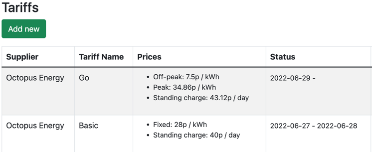
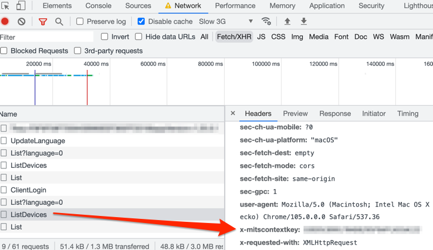
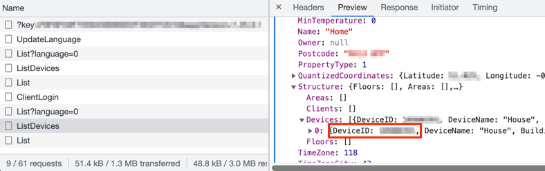

<a name="readme-top"></a>
<!--
*** Thanks for checking out the Best-README-Template. If you have a suggestion
*** that would make this better, please fork the repo and create a pull request
*** or simply open an issue with the tag "enhancement".
*** Don't forget to give the project a star!
*** Thanks again! Now go create something AMAZING! :D
-->


<!-- PROJECT LOGO -->
<br />
<div align="center">
  <a href="https://github.com/electric-sheep-energy/home-analytics">
    
  </a>

  <p align="center">
    Monitor and analyze your home energy usage, costs and trends
  </p>
</div>


<!-- TABLE OF CONTENTS -->
<details>
  <summary>Table of Contents</summary>
  <ol>
    <li><a href="#about-homeAnalytics">About The Project</a></li>
    <li><a href="#-key-features">Key Features</a></li>
    <li><a href="#-getting-started">Getting Started</a>
        <ul>
            <li><a href="#setting-up-n3rgy">Setting up n3rgy</a></li>
        </ul>
    </li>
    <li><a href="#-raspbery-pi-installation">Raspberry Pi Installation</a></li>
    <li><a href="#-integrations">Integrations</a>
        <ul>
            <li><a href="#-heating">Heating</a></li>
            <li><a href="#-cars">Cars</a></li>
            <li><a href="#-car-charging">Car Charging</a></li>
            <li><a href="#others">Others</a></li>
        </ul>
    </li>
    <li><a href="#-roadmap">Roadmap</a></li>
    <li><a href="#-built-with">Built With</a></li>
    <li><a href="#-contributing">Contributing</a></li>
    <li><a href="#-license">License</a></li>
    <li><a href="#-contact">Contact</a></li>
    <li><a href="#-acknowledgments">Acknowledgments</a></li>
  </ol>
</details>


<!-- ABOUT THE PROJECT -->
## About homeAnalytics

![product-screenshot]

HomeAnalytics aims to open up the data behind your home energy usage and make it more usable, useful, and transparent.

With homeAnalytics, you can track your energy usage over time and spot trends that your standard smart meter doesn't provide.

Using a home server such as a Raspberry Pi, you can easily <a href="https://medium.com/electric-sheep-energy/building-a-diy-energy-monitor-with-a-raspberry-pi-a5ae40c1a2a6">set up homeAnalytics as an always-on display</a>, giving you a fully customizable, near real-time home energy monitor.

<p align="right">(<a href="#readme-top">back to top</a>)</p>


## 🎯 Key Features

- View and analyse your energy usage over time
- Almost real-time data, at half-hourly granularity
- View accurate energy cost data, with support for off-peak tariffs such as Octopus Go
- View and analyze your EV battery status, range and mileage over time
- Usable as a Raspberry Pi powered Home Energy Monitor display


<!-- GETTING STARTED -->
## 🙋 Getting Started

If you just want to try out homeAnalytics, run the Docker Compose script with the following command to get it running:

```sh
docker-compose -f docker-compose.yml up
```

This will build 2 containers, 1 for the web UI and one for the data collection tasks. The SQLite database will be created using the path defined in the `/.env` file for the variable `HA_DB_URL`.

When the containers are up and running, navigate to http://localhost:3000/admin/list-tariffs and add in the details of your Electricity tariff. For your current tariff, leave the end date blank, for example:



You then need to follow the steps below for setting up n3rgy API account, and enter the authorization header value as the value for `auth_header` at http://localhost:3000/admin/view-entity?id=1


### Setting up n3rgy

- Find your MPxN number (a 13 digit number, should be on your electricity bill) and note it down. If you need help finding it, [UK Power Networks](https://www.ukpowernetworks.co.uk/help/who-is-my-electricity-supplier-and-what-is-my-mpan) can help.
- Find your IHD MAC address and note it down. This is usually on your smart meter device somewhere - [this guide](https://www.howz.com/mac) should help locate it.
- Go to the [n3rgy Consumer Site](https://data.n3rgy.com/consumer/home) and enter your MPxN number and IHD MAC address
- Once you're logged in, click on the 'Download My Data' link, open up Chrome Dev Tools, click the 'Download' link, and find the value of the **authorization** request header as shown below:

![n3rgy-screenshot]


## 🥧 Raspbery Pi Installation
_To install on Raspberry Pi, you need a 64bit OS, as [Prisma.io](https://prisma.io) does not support 32bit._

1. Open the terminal on your Raspberry Pi and install the Github Client:

```sh
curl -fsSL https://cli.github.com/packages/githubcli-archive-keyring.gpg | sudo dd of=/usr/share/keyrings/githubcli-archive-keyring.gpg
sudo chmod go+r /usr/share/keyrings/githubcli-archive-keyring.gpg
echo "deb [arch=$(dpkg --print-architecture) signed-by=/usr/share/keyrings/githubcli-archive-keyring.gpg] https://cli.github.com/packages stable main" | sudo tee /etc/apt/sources.list.d/github-cli.list > /dev/null
sudo apt update
sudo apt install gh
```

2. Clone this project into a suitable directory, ie `/var/www/homeanalytics`

3. Install Node.js:

```sh
curl -fsSL https://deb.nodesource.com/setup_18.x | sudo -E bash -
sudo apt-get install -y nodejs
```

4. Install Node.js dependencies:

```sh
cd /[PROJECT_PATH]/app/web
npm i
```

5. Initialize the Prisma client by running `npx prisma generate`

6. Install Python dependencies:

```sh
cd /[PROJECT_PATH]/app/tasks
pip3 install -r ./requirements.txt
```

7. Set the DB path as an environment variable:
```sh
echo "export HA_DB_URL=/[PROJECT_PATH]/db/prod.db" >> ~/.profile
```
Then restart your shell session so the env variable is loaded for the next steps.

8. Set up the cron tasks - adapt `example-crontab.txt` to your project paths and copy the content into the crontab editor (`crontab -e`)

9.  Run the Web UI in the background using [PM2](https://pm2.keymetrics.io/)

```sh
sudo npm install -g pm2
pm2 start "cd /[PROJECT_PATH]/app/web/; npm run dev"
pm2 save
```

10. You should now be able to access your installation on your local network at the Pi's IP address, for example `http://10.0.0.5:3000`
 
### 📺 Pi Kiosk Display

If you want to connect your Pi to a display ([as demonstrated here](https://medium.com/electric-sheep-energy/building-a-diy-energy-monitor-with-a-raspberry-pi-a5ae40c1a2a6)), you can set up Chrome to run in 'kiosk mode'. To do this, log into your Pi directly or via VNC (the Chrome command **will fail** via SSH), and launch the terminal window.

First of all, disable screensaver and power-saving settings:

```sh
sudo nano /etc/xdg/lxsession/LXDE/autostart
```
Comment out the line:

`@xscreensaver -no-splash`

And add these lines:

```
@xset s off
@xset -dpms
@xset s noblank
```

You may need to disable screen blanking in raspi-config too:

```sh
sudo raspi-config
```

Navigate to **Display Options**, find **Screen Blanking** and turn it off. You will need to restart your Pi for changes to take effect.

Finally run the following command from a VNC terminal window to launch a full screen instance of Chrome:

```sh
chromium-browser --noerrdialogs --disable-infobars --kiosk http://localhost:3000/pi &
```

You can then safely exit the VNC session.

<!-- USAGE EXAMPLES -->
## 🧩 Integrations

A small number of smart home integrations are available in the Python tasks folder, although it should be easy to build new ones.

To enable the integrations, uncomment the relevant lines in the crontab.

### 🌞 Heating

#### Mitsubishi Ecodan
To add a Mitsubishi Ecodan heat pump, you need to examine the HTTP requests that the [MelCloud web app](https://app.melcloud.com/) sends to find your heat pump's device ID and the MITSI_CONTEXT_KEY. 

For the `MITSI_CONTEXT_KEY` value, log in to the MelCloud app and inspect the value of the **x-mitscontextkey**:



For Device ID, inspect the response and look for `DeviceID` in _Structure > Devices_:



Then <a href="http://localhost:3000/admin/list-entities">add an entity</a> named 'Ecodan', with the following setup:


Next, enable the `/app/tasks/melcloud.py` script in the crontab.

### 🚘 Cars
#### Kia
Tested on an E-Niro EV, however the integration should work for Kia cars, and possibly Hyundai vehicles (untested).

To set up a Kia vehicle, add its details in **Admin > Garage** (including VIN), then <a href="http://localhost:3000/admin/list-entities">add an entity</a> with your app login credentials as follows:


Then enable the `/app/tasks/kia.py` script in the crontab.

#### Renault
Tested on a Renault Zoe ZE40.

To set up a Renault vehicle, add its details in **Admin > Garage**, then <a href="http://localhost:3000/admin/list-entities">add an entity</a> with your app login credentials as follows:


Then enable the `/app/tasks/renault.py` script in the crontab.

### ⛽️ Car Charging
#### Pod Point
Usage and cost data can be obtained if you have a Pod Point home charger. Tested on a Solo 1 model.

To set up, <a href="http://localhost:3000/admin/list-entities">add an entity</a> named 'Pod Point', and add your user credentials that you use to log into your app:


Then enable the `/app/tasks/podpoint.py` script in the crontab.

### 🔌 Energy Monitoring Smart Plugs
#### Tasmota
*Note: This is an under-development feature so may change without notice.*

Smart plugs that use the Tasmota software can publish energy usage data that can be consumed by homeAnalytics.

**Step 1:**
Set up your MQTT broker. If you have one already set-up, you can skip this step.

If you're using a Raspberry Pi or similar, always-on server, you can follow these steps:

```sh
sudo apt update && sudo apt upgrade
sudo apt install -y mosquitto mosquitto-clients
sudo systemctl enable mosquitto.service

sudo nano /etc/mosquitto/mosquitto.conf
```

Then add the following lines to the bottom of the `mosquitto.conf` file:
```
listener 1883
allow_anonymous true
```

Next, restart the MQTT broker:

```sh
sudo systemctl restart mosquitto
```

Note the local IP address of your server/Pi:
```sh
hostname -I
```

**Step 2:**
Configure your smart plug - go to your smart plug's IP address, and click **Configuration -> Configure MQTT**.

Then enter your MQTT Broker's Host IP, and rename the Topic to something easier to read:


The plug will now start publishing to the broker every 5 minutes.

**Step 3**

Add a `.env` file to the `/app/tasks/` folder, containing the MQTT broker IP address, for example:

```
MQTT_BROKER=10.0.0.03
```

**Step 4**
Add the smart plug(s) as entities in homeAnalytics Admin area, setting the **Entity Backend** select box to 'Tasmota MQTT'. 

Then add a credential with `topic` as the key, and the energy sensor as the value. This is generally in the format **tele/your_device_topic/SENSOR**, for instance:

```
tele/conservatory_heater/SENSOR
```

**Step 5**
Run the `tasks/tasmota.py` script in the background - it will continuously run and consume the data for all devices.

For example:

```sh
pm2 start "cd /[PROJECT_PATH]/app/tasks/; python3 tasmota.py"
pm2 save
```

### Others

#### 💨 Carbon Intensity
You can collect Carbon Intensity data for your postcode from [CarbonIntensity.org](https://api.carbonintensity.org.uk/), just add an entity called 'Carbon Intensity', with the credential key/value of `postcode` and the first segment of your postcode.

Then enable the `/app/tasks/carbon_intensity.py` script in the crontab.


<p align="right">(<a href="#readme-top">back to top</a>)</p>


<!-- ROADMAP -->
## 🛣 Roadmap

- [ ] Add Changelog
- [ ] Add guide to contributing new integrations
- [ ] Add web UI management of cron tasks
- [ ] Add Pi display screen management
- [ ] Tidy up Javascript for Pi screen
- [ ] Add more smart devices
- [ ] Add Octopus Energy API as an alternative half-hourly data source
- [ ] Add instructions/functionality for [mDNS function](https://developer.ridgerun.com/wiki/index.php/How_to_use_mDNS_to_access_a_device_without_knowing_the_IP_address)

See the [open issues](https://github.com/electric-sheep-energy/home-analytics/issues) for a full list of proposed features (and known issues).

<p align="right">(<a href="#readme-top">back to top</a>)</p>

## 🧱 Built With

The core frameworks used in this project:

* [![Express][Express.js]][Express-url]
* [![Python][Python]][Python-url]
* [![SQLite][SQLite]][SQLite-url]
* [![Bootstrap][Bootstrap.com]][Bootstrap-url]
* [![JQuery][JQuery.com]][JQuery-url]

<p align="right">(<a href="#readme-top">back to top</a>)</p>


<!-- CONTRIBUTING -->
## 👏 Contributing

Contributions are what make the open source community such an amazing place to learn, inspire, and create. Any contributions you make are **greatly appreciated**.

If you have a suggestion that would make this better, please fork the repo and create a pull request. You can also simply open an issue with the tag "enhancement".

Don't forget to give the project a star! Thanks again!

1. Fork the Project
2. Create your Feature Branch (`git checkout -b feature/AmazingFeature`)
3. Commit your Changes (`git commit -m 'Add some AmazingFeature'`)
4. Push to the Branch (`git push origin feature/AmazingFeature`)
5. Open a Pull Request

<p align="right">(<a href="#readme-top">back to top</a>)</p>


<!-- LICENSE -->
## 📄 License

Distributed under the MIT License. See `LICENSE.txt` for more information.

<p align="right">(<a href="#readme-top">back to top</a>)</p>


<!-- CONTACT -->
## ✉️ Contact

Rob Hammond - [@robhammond](https://twitter.com/robhammond) - contact@rjh.am

Project Link: [https://github.com/electric-sheep-energy/home-analytics](https://github.com/electric-sheep-energy/home-analytics)

<p align="right">(<a href="#readme-top">back to top</a>)</p>


<!-- ACKNOWLEDGMENTS -->
## 🙌 Acknowledgments

Some very useful projects that have helped make this tool possible:

* [HomeAssistant](https://www.home-assistant.io/)
* [Python Pod Point Client](https://github.com/mattrayner/podpointclient)
* [Python Renault API](https://github.com/mattrayner/podpointclient)
* [Python Kia/Hyundai API](https://github.com/Hyundai-Kia-Connect/hyundai_kia_connect_api)
* [n3rgy Consumer Data](https://data.n3rgy.com/consumer/home)
* [UK Numberplate Font](https://www.attrill.uk/fonts/uknumberplate/)
* [Best README Template](https://github.com/othneildrew/Best-README-Template)

<p align="right">(<a href="#readme-top">back to top</a>)</p>


<!-- MARKDOWN LINKS & IMAGES -->
<!-- https://www.markdownguide.org/basic-syntax/#reference-style-links -->
[contributors-shield]: https://img.shields.io/github/contributors/electric-sheep-energy/home-analytics.svg?style=for-the-badge
[contributors-url]: https://github.com/electric-sheep-energy/home-analytics/graphs/contributors
[forks-shield]: https://img.shields.io/github/forks/electric-sheep-energy/home-analytics.svg?style=for-the-badge
[forks-url]: https://github.com/electric-sheep-energy/home-analytics/network/members
[stars-shield]: https://img.shields.io/github/stars/electric-sheep-energy/home-analytics.svg?style=for-the-badge
[stars-url]: https://github.com/electric-sheep-energy/home-analytics/stargazers
[issues-shield]: https://img.shields.io/github/issues/electric-sheep-energy/home-analytics.svg?style=for-the-badge
[issues-url]: https://github.com/electric-sheep-energy/home-analytics/issues
[license-shield]: https://img.shields.io/github/license/electric-sheep-energy/home-analytics.svg?style=for-the-badge
[license-url]: https://github.com/electric-sheep-energy/home-analytics/blob/master/LICENSE.txt
[linkedin-shield]: https://img.shields.io/badge/-LinkedIn-black.svg?style=for-the-badge&logo=linkedin&colorB=555
[linkedin-url]: https://linkedin.com/in/robhammond
[product-screenshot]: assets/screenshot.png
[n3rgy-screenshot]: assets/n3rgy-auth.png
[Express.js]: https://img.shields.io/badge/express.js-%23404d59.svg?style=for-the-badge&logo=express&logoColor=%2361DAFB
[Express-url]: https://expressjs.org/
[Python]: https://img.shields.io/badge/python-3670A0?style=for-the-badge&logo=python&logoColor=ffdd54
[Python-url]: https://python.org/
[SQLite]: https://img.shields.io/badge/sqlite-%2307405e.svg?style=for-the-badge&logo=sqlite&logoColor=white
[SQLite-url]: https://sqlite.org/
[Bootstrap.com]: https://img.shields.io/badge/Bootstrap-563D7C?style=for-the-badge&logo=bootstrap&logoColor=white
[Bootstrap-url]: https://getbootstrap.com
[JQuery.com]: https://img.shields.io/badge/jQuery-0769AD?style=for-the-badge&logo=jquery&logoColor=white
[JQuery-url]: https://jquery.com 